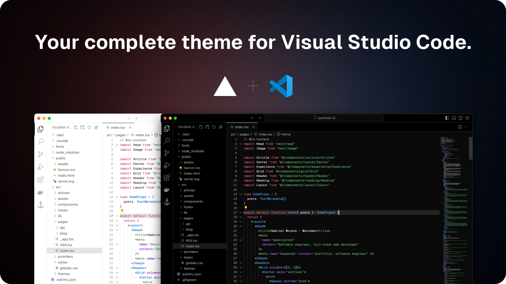

<p align="center">
  <a href="https://vercel.com">
    
    <h3 align="center">Subaru</h3>
  </a>
</p>

<p align="center">
  Download. Develop. Ship.
</p>

# VSCode Vercel

A carefully crafted set of colorschemes that are faithful to [Next.js](https://nextjs.org) & [Vercel](https://vercel.com)'s docs.

<p align="center">
  
</p>

## Installation

### From Visual Studio Marketplace

1. Open VS Code
2. Go to Extensions (Ctrl+Shift+X)
3. Search for "Subaru Theme"
4. Click Install

### From Open VSX Registry

Available on [Open VSX](https://open-vsx.org/) for VS Code compatible editors.

## Development

### Local Testing

Use the provided development script to test the theme locally:

```bash
# Package and install locally
./dev.sh test

# Just package
./dev.sh package

# Clean up generated files
./dev.sh clean
```

### Deployment

This extension is automatically deployed using GitHub Actions. See [DEPLOYMENT.md](DEPLOYMENT.md) for setup instructions.

## License

Licensed under the [MIT](https://opensource.org/licenses/MIT) license.
